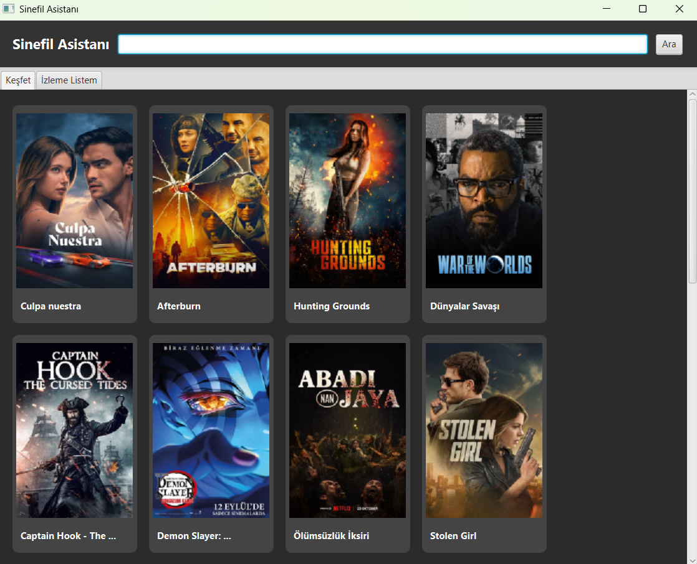
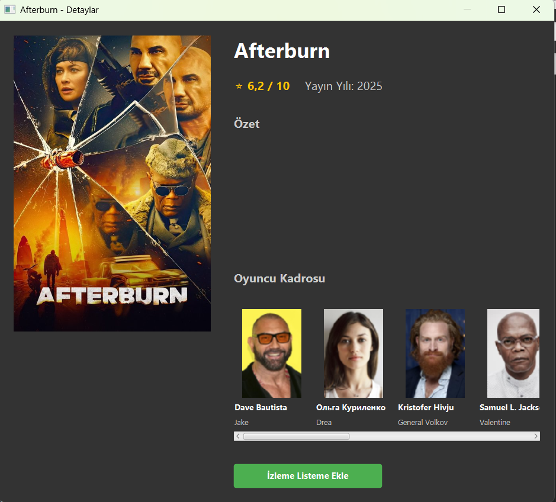
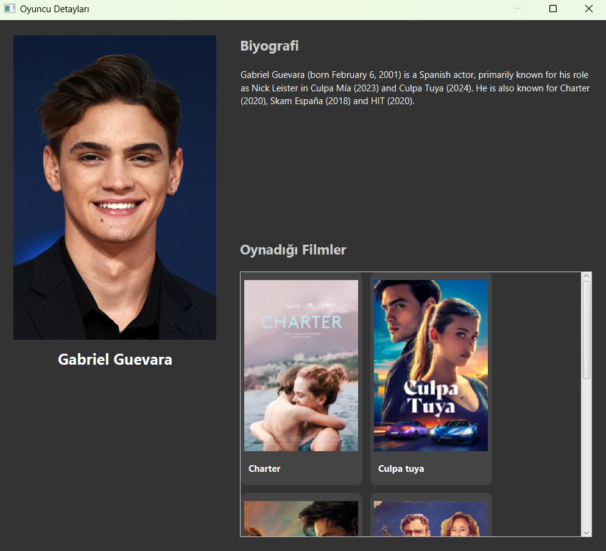
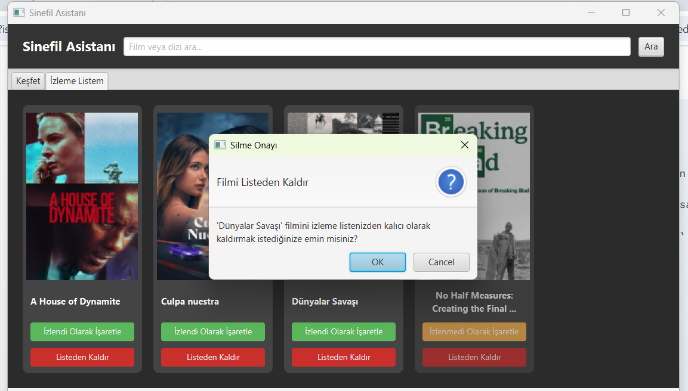

# Sinefil Asistanı (JavaFX Sinema Uygulaması)

TMDb (The Movie Database) API'sini kullanan, JavaFX ile geliştirilmiş bir masaüstü sinema keşif ve izleme listesi uygulamasıdır. Kullanıcıların popüler filmleri aramasına, detaylarını (puan, özet, oyuncu kadrosu) görmesine, oyuncuların biyografilerine ve filmografilerine ulaşmasına ve kişisel izleme listelerini yerel bir veritabanında yönetmesine olanak tanır.


Uygulamanın temel fonksiyon akışı:

1.  **Ana Ekran (Keşfet & Arama):** Kullanıcı popüler filmleri görür veya yeni filmler arar.
2.  **Film Detayları:** Bir filme tıklandığında puan, yıl, özet ve oyuncu kadrosu yüklenir.
3.  **Oyuncu Detayları (Derinlemesine Gezinme):** Bir oyuncuya tıklandığında, o oyuncunun biyografisi ve oynadığı diğer filmler (filmografi) yüklenir.
4.  **İzleme Listesi (Veritabanı):** Kullanıcı filmleri listeye ekleyebilir, "İzlendi" olarak işaretleyebilir veya "Silme Onayı" ile listeden kaldırabilir.

## 🎞️ Arayüz Görüntüleri






## ✨ Temel Özellikler

* **API Entegrasyonu:** TMDb API'sinden canlı olarak veri çeker.
* **Popüler Filmler:** Açılışta popüler filmleri listeler.
* **Arama:** Film adına göre arama yapar.
* **Film Detayları:** Tıklanan filmin afişini, özetini, puanını (⭐ 8.5 / 10) ve yayın yılını gösterir.
* **Oyuncu Kadrosu:** Film detay sayfasında o filmin oyuncu kadrosunu listeler.
* **Derinlemesine Gezinme (Arşa Çıkan Özellik):**
    * Oyuncuya tıklandığında, oyuncunun biyografisini (İngilizce) ve filmografisini (oynadığı diğer filmler) gösteren yeni bir pencere açar.
    * Bu filmografiden başka bir filme tıklanarak tekrar o filmin detay sayfasına geçilebilir.
* **Kişisel İzleme Listesi (CRUD & Veritabanı):**
    * **Create (Ekleme):** Filmleri yerel bir SQLite veritabanına ekleme.
    * **Read (Okuma):** "İzleme Listem" sekmesinde filmleri listeleme.
    * **Update (Güncelleme):** Filmleri "İzlendi" veya "İzlenmedi" olarak işaretleme (Durum `UPDATE` komutu ile veritabanına kaydedilir).
    * **Delete (Silme):** Filmleri listeden kalıcı olarak silme (Kullanıcı onayı `Alert` penceresi ile alınır).
* **Güvenli API Kullanımı:** API anahtarı, `.gitignore` dosyası ile korunur ve GitHub'a yüklenmez.

## 🛠️ Kullanılan Teknolojiler

* **Java (JDK 23)**
* **JavaFX:** Modern masaüstü kullanıcı arayüzü (UI) için.
* **Maven:** Proje yönetimi ve bağımlılıklar için.
* **SQLite-JDBC:** Kişisel izleme listesini depolamak için yerel veritabanı.
* **TMDb API:** Tüm sinema verileri için (Filmler, Oyuncular, Puanlar).
* **Gson:** API'den gelen JSON yanıtlarını Java nesnelerine (POJO) dönüştürmek için.
* **Java 11+ HttpClient:** API'ye asenkron (asynchronous) HTTP istekleri göndermek için.

## 🚀 Kurulum ve Çalıştırma

Bu projeyi yerel makinenizde çalıştırmak için aşağıdaki adımları izleyin.

### 1. Ön Gereksinimler
* Java JDK 21 veya daha yenisi.
* Maven.
* IntelliJ IDEA veya benzeri bir IDE.

### 2. Depoyu Klonlama
```bash
git clone (https://github.com/alisemiz/SinefilAsistani-JavaFX.git)
cd SinefilAsistani-JavaFX
```


### 3. API Anahtarını Ayarlama (Çok Önemli)

Bu projenin çalışması için kişisel bir TMDb API v3 Anahtarına ihtiyacınız vardır.

1.  [The Movie Database (TMDb)](https://www.themoviedb.org/) sitesine üye olun ve Ayarlar > API bölümünden bir anahtar talep edin.
2.  Projenin `src/main/resources/` klasörü altına `config.properties` adında yeni bir dosya oluşturun.
3.  Oluşturduğunuz bu dosyanın içine tam olarak aşağıdaki satırı ekleyin (kendi anahtarınızı yapıştırın):

    ```properties
    tmdb.api.key=SIZIN_TMDb_API_v3_ANAHTARINIZ_BURAYA_GELECEK
    ```
4.  (Bu dosya, güvenlik nedeniyle `.gitignore` içinde listelenmiştir ve deponuza geri gönderilmez.)

### 4. Projeyi Çalıştırma

Bu proje bir JavaFX projesidir ve modül bağımlılıkları nedeniyle standart "Run" butonu ile çalışmayabilir. Projeyi derlemek ve çalıştırmak için **Maven JavaFX Plugin**'i kullanılmalıdır.

1.  Projeyi IntelliJ IDEA ile açın ve Maven bağımlılıklarının indirilmesini bekleyin (`pom.xml`'i yükleyin).
2.  IntelliJ IDEA'nın sağ tarafındaki **Maven** sekmesini açın.
3.  Ağaç yapısından **Plugins > javafx**'i bulun.
4.  **`javafx:run`** hedefine (goal) çift tıklayın.

Uygulama derlenecek ve başlayacaktır.
